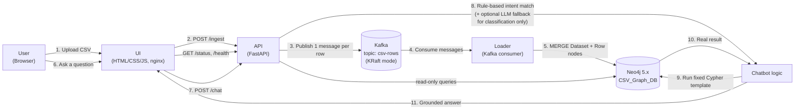
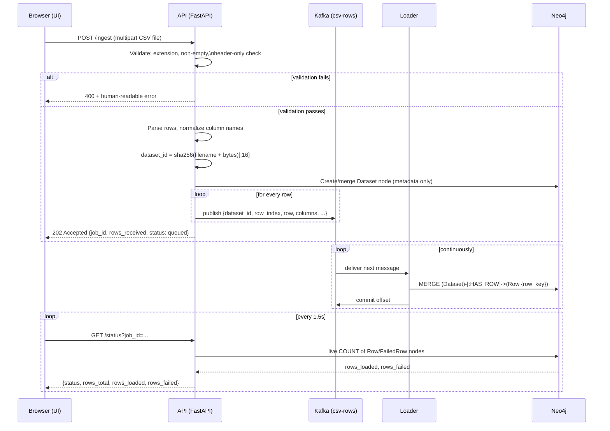
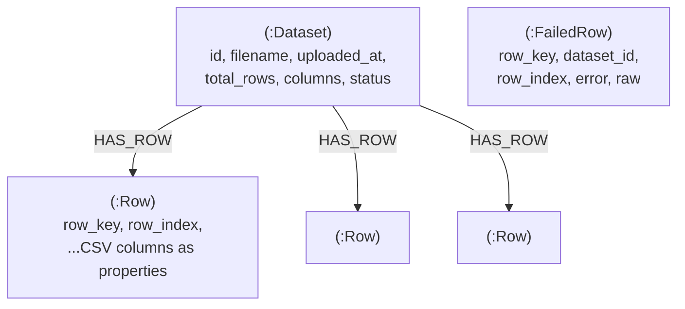
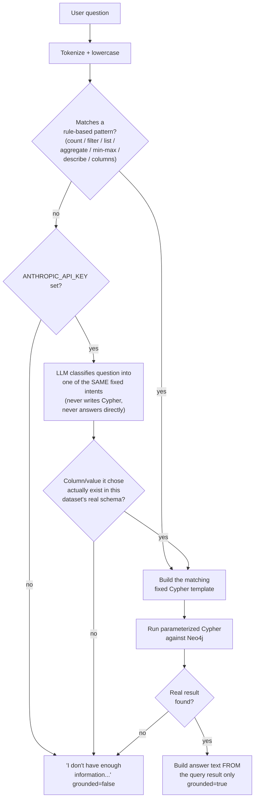
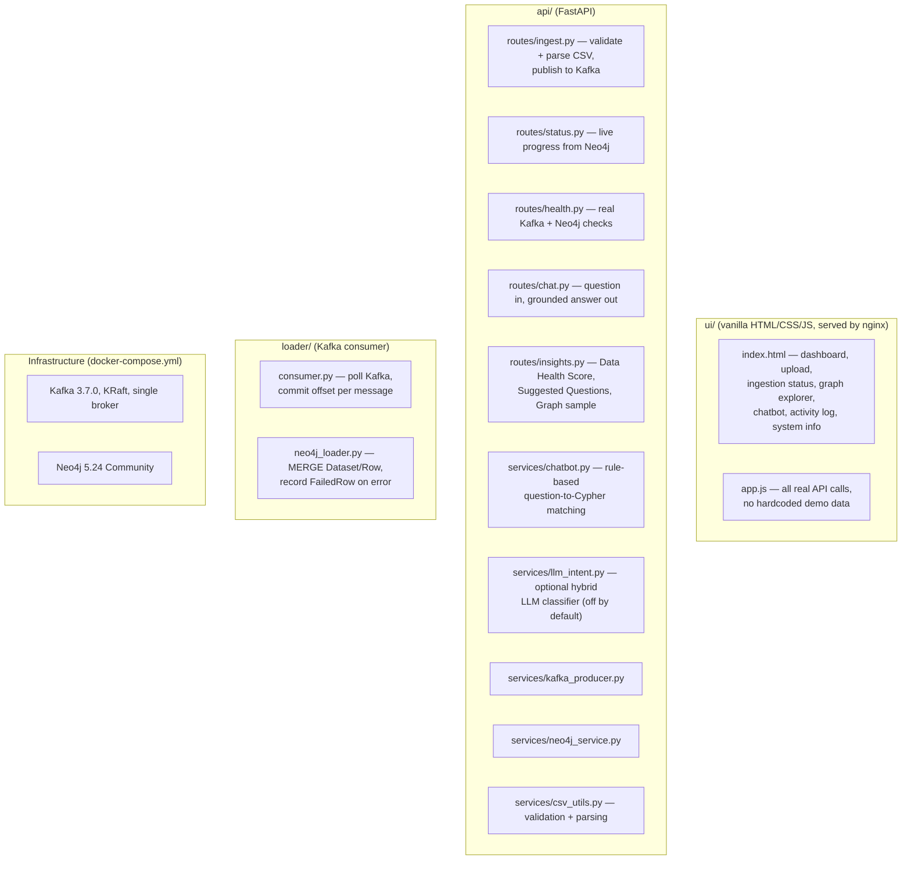

# Data In, Answers Out
## CSV &rarr; Kafka &rarr; Neo4j &rarr; Chatbot Pipeline — Full Project Report

---

## 1. What this project is

A complete, working data pipeline that takes an arbitrary CSV file uploaded through a web UI, streams every row through Apache Kafka, loads it into a Neo4j graph database, and answers natural-language questions about that data through a **deterministic, rule-based chatbot** — with **no LLM required at runtime**. An optional, tightly-scoped hybrid LLM step can assist with question *understanding* only, never with generating the final answer.

Every answer the chatbot gives is either backed by a real Cypher query against Neo4j (`grounded: true`) or is an honest refusal (`grounded: false`) — the system never invents data that isn't in the uploaded file.

---

## 2. High-level architecture



**Why Kafka sits in the middle:** the API never writes row data to Neo4j directly. It publishes each row as a Kafka message and returns immediately; the Loader is a separate process that consumes those messages and writes to Neo4j at its own pace. This means a slow or temporarily unavailable Neo4j never blocks a CSV upload, and the ingestion pipeline can be scaled or restarted independently of the API.

---

## 3. Detailed request flow: uploading a CSV



### Key design decisions in this flow

| Decision | Why |
|---|---|
| `dataset_id = sha256(filename + file bytes)` | Re-uploading the *exact same* file always maps to the same `dataset_id`, so the Loader's `MERGE` is a true no-op the second time — this is what makes duplicate uploads idempotent. |
| Row key = `f"{dataset_id}_{row_index}"`, and `MERGE` (never `CREATE`) is used for every Row/Dataset/FailedRow write | Guarantees no duplicate nodes even if Kafka redelivers a message (crash/restart) or the same file is uploaded twice. |
| `/status` counts are **live Cypher queries** (`MATCH (d)-[:HAS_ROW]->(r) RETURN count(r)`), never an incrementing counter | A counter could double-count on message replay; a live count of real graph nodes cannot lie, and self-heals after any restart. |
| Failed rows are written as `(:FailedRow)` nodes instead of being silently dropped | `rows_failed` in `/status` is a real, queryable number — not a guess. |
| API never writes row/column data to Neo4j itself, only the Loader does | Satisfies the requirement that uploaded CSV *data* reaches Neo4j only through Kafka. The API is only allowed to write a `Dataset` metadata node so `/status` has something to report before the Loader starts. |

---

## 4. The Neo4j graph model



The model is intentionally generic (`Dataset` &rarr; `Row`) rather than a fixed schema, because the CSV structure is unknown ahead of time — any CSV with any columns can be uploaded, and every column becomes a property on the `Row` node.

---

## 5. The chatbot: question &rarr; Cypher &rarr; answer



**The critical guarantee:** the LLM fallback (when enabled) is only ever allowed to pick *which* fixed Cypher template to run and *which* real column/value to plug into it — every choice it makes is re-validated against the dataset's actual schema before use. It never writes free-form Cypher and never generates the answer text; the answer is always built in code from the literal Neo4j query result. If the LLM (or the rule-based matcher) can't confidently map a question to a real template + real data, the honest refusal is returned instead of a guess.

### Supported question types (rule-based, no LLM needed)

| Intent | Example question | Cypher shape |
|---|---|---|
| Count all rows | "How many rows are there?" | `MATCH (r:Row) RETURN count(r)` |
| Count filtered | "How many rows are in Billing?" | `MATCH (r:Row {group:'Billing'}) RETURN count(r)` |
| Show matching rows | "Show Billing records" | `... WHERE r.group='Billing' RETURN r LIMIT 10` |
| List unique values | "What groups are available?" | `RETURN DISTINCT r.group` |
| Aggregation | "What is the average age?" | `RETURN avg(toFloat(r.age))` |
| Min / max | "What is the maximum age?" | `RETURN max(toFloat(r.age))` |
| Schema | "How many columns are there?" | reads `Dataset.columns` |
| Describe | "Describe the dataset" | row count + column list |

---

## 6. Component breakdown



---

## 7. WOW features (beyond the core requirements)

1. **Data Health Score** (`GET /insights`) — a 0-100 score computed from real column completeness (% non-missing values per column) and load completeness (rows loaded vs. rows total). Never a fabricated number.
2. **Smart Suggested Questions** — generated dynamically from the dataset's *actual* columns, so the suggestions always work against whatever was uploaded.
3. **Graph Explorer** — a dependency-free, pure-SVG radial layout of the real `Dataset` and sampled `Row` nodes (`GET /graph`), with click-to-inspect real node properties. No third-party graph-visualization library was added, so it carries zero risk to the core pipeline's build.

---

## 8. Reliability & error handling

- **Startup readiness:** the API and Loader both retry connecting to Kafka and Neo4j on startup instead of assuming the container being "up" means the service is ready; `docker-compose.yml` also uses real health checks (`service_healthy`) so dependent containers wait properly.
- **Idempotent loading:** every write uses `MERGE` on a stable key (`dataset_id + row_index` for rows, content hash for `dataset_id` itself) — uploading the same file twice never creates duplicate nodes.
- **Input validation:** empty files, header-only files, and non-`.csv` files all return clean `400` responses with a specific message — never a raw `500`.
- **Global exception safety net:** any unanticipated server error still returns clean JSON instead of a bare crash page (added after a real-world CSV — one with a stray `\r` character inside a text field — triggered an uncaught `csv.Error`; the parser was hardened and this safety net was added on top).
- **Large files:** nginx's reverse proxy is configured for large request bodies and long timeouts (a 60,000-row / 7.5 MB CSV was verified to upload and fully load with zero failures).
- **Non-root containers, pinned image versions:** `apache/kafka:3.7.0`, `neo4j:5.24-community` — no `latest` tags anywhere; the `api`, `loader`, and `ui` containers all run as a dedicated non-root user.

---

## 9. Technology stack

| Layer | Technology |
|---|---|
| Frontend | Vanilla HTML / CSS / JavaScript (Tailwind via CDN), served by nginx |
| Backend API | Python 3.11, FastAPI |
| Message broker | Apache Kafka 3.7.0, KRaft mode, single broker |
| Database | Neo4j 5.24 Community Edition, official Python driver |
| Chatbot | Rule-based Cypher templates; optional hybrid LLM (Anthropic API) for question classification only |
| Containerization | Docker + Docker Compose |

---

## 10. What was actually verified (not just written)

- Clean `docker compose down -v && docker compose up --build` from a fully empty volume — all 5 containers reach healthy/running with zero manual steps.
- `GET /health` returns real `kafka_connected` / `neo4j_connected` booleans backed by an actual Kafka metadata fetch and a Neo4j `verify_connectivity()` call.
- A 15-row CSV traced end-to-end: `/ingest` &rarr; Kafka topic `csv-rows` &rarr; Loader logs &rarr; confirmed present via `cypher-shell` directly against `csv-graph-db`.
- The same 15-row CSV uploaded twice: Neo4j still contains exactly 15 `Row` nodes.
- A 60,000-row / 7.5 MB CSV uploaded through the real UI: all 60,000 rows loaded, 0 failures.
- Chat tested for count-all, count-filtered, average, max, distinct-values, schema, and describe intents, plus deliberately off-topic and nonsense questions — every response carries the correct `grounded` flag.
- Empty CSV, header-only CSV, and a non-`.csv` file all return clean `400`s, never a `500`.
- Full UI click-path exercised in a real browser: upload &rarr; live progress &rarr; dashboard KPIs/preview table populate from Neo4j &rarr; suggested-question chip clicked &rarr; grounded chat answer with real Cypher/result shown &rarr; Graph Explorer node click shows real row properties.

---

## 11. Known limitations

- The rule-based chatbot cannot understand unlimited natural-language phrasing by design; the optional LLM fallback widens coverage but is still restricted to the same fixed set of query templates and never fabricates an answer.
- `/chat` and `/status` operate on one dataset at a time (the most recently uploaded, or an explicit `job_id`) — there is no cross-dataset querying.
- A Loader restart can incur a short (up to ~30-45s) delay before Kafka reassigns its consumer group partitions; this affects latency only, never correctness, since `MERGE` makes any replay safe.

---

## 12. How to run it

```bash
git clone <this-repo>
cd <repo-folder>
cp .env.example .env   # fill in NEO4J_PASSWORD at minimum
docker compose up --build
```

Then open the UI (default `http://localhost:3001`) and:
1. Upload a `.csv` file.
2. Watch the live ingestion progress.
3. Ask a question about the data in the chat panel.
4. Explore the graph in the Graph Explorer tab.

See `REPORT.md` for the original design-decision log and `README.md` for the full project specification this implementation follows.
